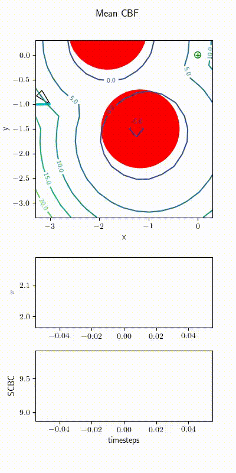
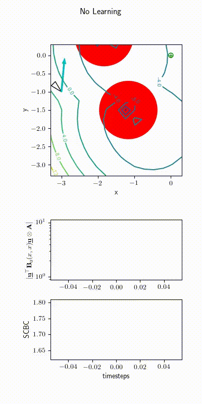

# Control Barriers in Bayesian Learning of System Dynamics


[Website](https://vikasdhiman.info/Bayesian_CBF/)
[Paper](./TAC313705.pdf)
[Capsule](https://codeocean.com/capsule/0004536/tree)

## Demo


## Installation

1. If you are using a Python virtual environment, edit setup.bash to point to the
  activate script of the virtual environment. One way to do that is:

  ``` shellsession
  python3_ver () 
  { 
      python3 -V 2>&1 | sed -e 's/.*3.\([0-9]\).*/py3\1/'
  }
  mkdir -p .tox/
  virtualenv --python=python3 .tox/$(python3_ver)
  ```


2. Install gurobi. Edit setup.bash to set GUROBI_LIB_PATH

3. Activate environment and install current package in edit mode

  ``` shellsession
  source setup.bash
  pip install -e .
  ```

## Run tests

``` shellsession
pytest
```

## Unicycle demos

1. To run experiment where unicycle with mean CBF collides with the obstacle run

   ```shellsession
   python -c 'from bayes_cbf.unicycle_move_to_pose import unicycle_mean_cbf_collides_obstacle; unicycle_mean_cbf_collides_obstacle()'
   ```

   
   
2. To run experiment where unicycle with Bayes CBF drives safely between the obstacles

   ```shellsession
   python -c 'from bayes_cbf.unicycle_move_to_pose import unicycle_bayes_cbf_safe_obstacle; unicycle_bayes_cbf_safe_obstacle()'
   ```

   
   
3. To run experiment where unicycle gets stuck without learning run

   ```shellsession
   python -c 'from bayes_cbf.unicycle_move_to_pose import unicycle_no_learning_gets_stuck; unicycle_no_learning_gets_stuck()'
   ```

   
   
4. To run experiment where unicycle passes safely through obstacles due to learning run

   ```shellsession
   python -c 'from bayes_cbf.unicycle_move_to_pose import unicycle_learning_helps_avoid_getting_stuck; unicycle_learning_helps_avoid_getting_stuck()'
   ```

   

## Pendulum demos

1. To run pendulum example and compare MVGP with CoGP

``` python
from bayes_cbf.pendulum import learn_dynamics_matrix_vector
learn_dynamics_matrix_vector()

```

2. To compare the computation requirement for MVGP vs CoGP vs diagonal

```python
from bayes_cbf.pendulum import speed_test_matrix_vector
speed_test_matrix_vector()
```


## Please cite

``` bibtex
@article{dhiman2021TACControlBarriers,
  author={Dhiman, Vikas and Khojasteh, Mohammad Javad and Franceschetti, Massimo and Atanasov, Nikolay},
  journal={IEEE Transactions on Automatic Control},
  title={Control Barriers in Bayesian Learning of System Dynamics},
  year={2021},
  volume={},
  number={},
  pages={1-1},
  doi={10.1109/TAC.2021.3137059}
  }
```
