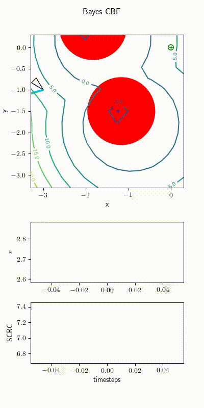

# BayesCBF


## Demo



## Installation

1. If you are using a Python virtual environment, edit setup.bash to point to the
  activate script of the virtual environment. One way to do that is:

  ``` shellsession
  python3_ver () 
  { 
      python3 -V 2>&1 | sed -e 's/.*3.\([0-9]\).*/py3\1/'
  }
  mkdir -p .tox/
  virtualenv --python=python3 .tox/$(python3_ver)
  ```


2. Install gurobi. Edit setup.bash to set GUROBI_LIB_PATH

3. Activate environment and install current package in edit mode

  ``` shellsession
  source setup.bash
  pip install -e .
  ```

## Run tests

``` shellsession
pytest
```

## Run scripts

1. A script to run pendulum example with random controller (No learning)
  ``` shellsession
  run_pendulum_control_trivial
  ```

2. A script to run pendulum example with CBF-CLF-controller (No learning)
  ``` shellsession
  run_pendulum_control_cbf_clf
  ```

3. A script to run Bayesian learning on pendulum example with random controller.
  ``` shellsession
  pendulum_learn_dynamics
  ```

4. A script to run Bayesian learning on pendulum example with CBF-CLF
   controller.
  ``` shellsession
  pendulum_control_online_learning
  ```

